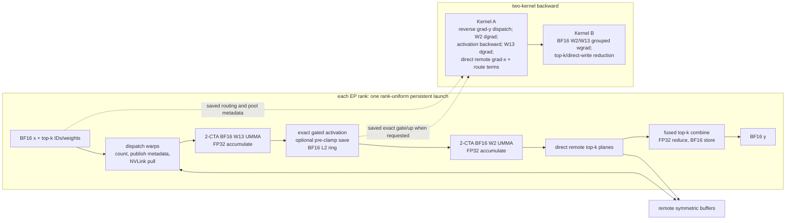

# BF16 MegaMoE design

## Scope and numerical contract

BF16 MegaMoE is a distinct communication-fused API. It consumes BF16 source
activations and BF16 master weights directly; it does not quantize either
operand and does not enter the MXFP8/FP4 API. SM100 tensor cores accumulate in
FP32. Every materialized GEMM or activation result is rounded once to BF16 at
the same boundary as the native BF16 grouped-MoE reference.

Routing IDs, masked routes, route weights, expert ownership, gate/up ordering,
activation clamps, and shared-expert boundaries are semantic inputs. Fast
approximations are excluded from parity runs. Empty experts and ranks with no
tokens produce exact zero outputs and gradients.

`RouteWeightMode` is an explicit API enum; DeepGEMM never infers it from a
model name. `PreDown` materializes unweighted `h` in BF16, multiplies it by the
FP32 route weight, materializes BF16 again, and feeds that value to W2.
`PostDown` feeds BF16 `h` to W2, materializes unweighted W2 output in BF16,
multiplies that output by the route weight, and materializes BF16 again before
combine. These two rounding boundaries are intentionally not algebraically
interchanged.

## Architecture

The persistent scheduler retains the existing expert-wave state machine. All
ranks launch the same grid, including zero-token ranks, so grid and NVLink
barriers remain rank-uniform. Logical full-pool metadata is separate from
physical ring slots; ring counters prevent a producer from reusing a slot
before all W13 or W2 N tiles have consumed it.

## Symmetric-buffer layout

The MXFP8/FP4 byte layout and API remain unchanged. The existing layout builder
is parameterized by MMA kind; `bf16xbf16` selects two-byte activation payloads
and omits all scale-factor regions. Let:

- `R` be the rank count, `E` the global expert count, and `Er = E / R`;
- `T` be the aligned maximum tokens per rank and `K` the top-k;
- `H` and `I` be hidden and intermediate dimensions;
- `Q` be the BF16 ring-token capacity;
- `B = Q / 8` be the count of minimum-size physical ring blocks;
- `P = align(R*T*min(K,Er) + Er*(192-1), 384)` be maximum logical pool rows.

Each rank allocates the following symmetric byte regions:

| Region | Bytes |
|---|---:|
| barriers | `32` |
| global send and receive counts | `16*E` |
| local expert receive sums | `8*Er` |
| four ring counter arrays | `16*B` |
| dispatch source token/top-k table | `4*Er*R*(R*T)` |
| full-pool source metadata `(rank, token, topk)` | `12*P` |
| workspace alignment | workspace total rounded to 16 bytes |
| local BF16 input `x` | `2*T*H` |
| top-k IDs | `8*T*K` |
| top-k weights | `4*T*K` |
| BF16 dispatch/L1 ring | `2*Q*H` |
| per-ring-row route weight | `4*Q` |
| BF16 activated/L2 ring | `2*Q*I` |
| BF16 remote combine planes | `2*K*T*H` |

The BF16 total is the aligned workspace plus all payload rows above. It has no
input, L1, or L2 scale-factor bytes. Typed views are returned without changing
the raw symmetric allocation ABI.

Optional exact pre-clamp gate/up is a caller-owned contiguous BF16 tensor of
shape `[P, 2*I]`, requiring `4*P*I` bytes. Keeping this training-only payload
outside SymBuffer avoids permanently increasing inference allocations. Rows
are indexed by logical pool row, and padding rows are zero.

## Forward kernel

### Warp roles

The launch contains 128 dispatch threads, 128 non-epilogue threads, and one or
two 128-thread epilogue warpgroups selected by block shape:

- dispatch warps count routes, reserve remote expert slots, publish source
  metadata, pull BF16 tokens, and clean counters after combine;
- non-epilogue warps independently issue activation TMA, weight TMA, and UMMA;
- epilogue warpgroups consume TMEM, apply gate/up activation, feed the BF16 L2
  ring, write W2 results to remote top-k planes, and combine those planes.

The scheduler assigns adjacent CTAs the same expert and M block with adjacent N
blocks. W13's N dimension is `2*I`, so one scheduler pass computes gate and up
together from interleaved BF16 weights. `PreDown` applies the route weight in
the activation epilogue; `PostDown` applies it to the BF16 W2 result during
remote combine write-back. Training callers request an optional full-pool BF16
save of the unweighted W2 result for the exact `PostDown` router gradient.

### TMA and UMMA layouts

W13 uses logical `A=[tokens,H]`, `B=[2I,H]`; W2 uses
`A=[activated,I]`, `B=[H,I]`. Both operands are BF16, K-major, and use 128-byte
TMA swizzles. A is split across and multicast to a two-CTA cluster; B loads one
128-column N tile per CTA. The instruction swaps A/B:

- `UMMA_M=256`, `UMMA_N=effective BLOCK_M`, `UMMA_K=16`;
- `SM100_MMA_F16BF16_2x1SM_SS` (`tcgen05.mma.cta_group::2.kind::f16`);
- FP32 TMEM accumulators, followed by RN BF16 conversion.

W13 stores `BLOCK_N/2` activated columns because each 128-column accumulator
tile contains interleaved gate/up pairs. W2 writes BF16 remote combine planes.
The final top-k reduction is FP32 in deterministic top-k-slot order and has one
BF16 output rounding.

### SMEM, TMEM, and registers

For block shape `(BM, BN=128, BK)`, one pipeline stage uses:

`2*(BM/2)*BK + 2*128*BK + 16` bytes

for BF16 A, BF16 B, and full/empty barriers. Fixed SMEM contains 1-KiB-aligned
expert counts and dispatch buffers, the larger of two-stage W13 output staging
or W2 output staging, epilogue/combine barriers, and the TMEM pointer. Stages
are selected by:

`floor((232448 - fixed_smem) / per_stage_smem)`, with at least two stages.

Representative BF16 configurations are feasible at five to eight stages:
small-M shapes use larger BK, while `BM=128, BK=64` uses about 24.6 KiB per
stage and admits eight stages for common expert/hidden sizes. The generated
configuration is the source of truth and is guarded against the 232,448-byte
SM100 limit.

Two FP32 accumulator stages require `2*BM` TMEM columns, aligned by the common
TMEM helper and statically bounded by 512 columns. Register redistribution is
48/40/208 registers per dispatch/non-epilogue/epilogue thread for at most 64
local experts, and 96/88/160 otherwise; the launch is statically bounded by
64,512 registers.

## Backward split and CTA-group restriction

Kernel A reuses the two-CTA persistent communication/scheduler structure.
Every rank first exposes BF16 grad-y in symmetric memory. Dispatch warps reverse
the saved full-pool mapping. The math pipeline computes W2 dgrad, exact
activation derivatives from saved pre-clamp gate/up when available, and W13
dgrad with FP32 accumulation and BF16 materialization. It writes each selected
route's grad-x directly to its source rank and emits the FP32 route-gradient
term at the same route-weight boundary as forward.

For `PreDown`, Kernel A computes BF16
`g_h_unweighted = W2^T @ g_y`, uses
`dot(g_h_unweighted, h)` for the router term, and materializes
`g_h = BF16(p * g_h_unweighted)` for activation backward. Kernel B's W2
operands are raw BF16 `g_y` and BF16 `p*h`. For `PostDown`, Kernel A first
materializes BF16 `p*g_y`; both W2 dgrad and Kernel B W2 wgrad consume it while
their forward operand is unweighted BF16 `h`. Its router term is
`dot(g_y, y_unweighted)`, where `y_unweighted` is the exact BF16 value saved by
forward.

Kernel B consumes BLOCK_M-padded per-expert pools. It computes W2 and combined
W13 grouped weight gradients and performs the protected top-k/direct-write
reduction. BF16 grouped wgrad is a dedicated one-CTA specialization:
`tcgen05.mma.cta_group::1.kind::f16`. It must not be changed to
`.cta_group::2` without redesigning grouped scheduling, TMA multicast, TMEM
ownership, and output-tile partitioning. Unlike forward/dgrad, adjacent wgrad
tiles do not inherently share the same grouped K interval, and the current
single-CTA grouped-layout contract is what makes empty and padded expert rows
harmless. Kernel A may use `.cta_group::2`; Kernel B remains `.cta_group::1`.

Each router dot is reduced with explicit FP32 multiply and add in increasing
hidden-index order, then written in the route tensor's dtype. Invalid routes,
empty experts, padded rows, and zero-token ranks are explicitly zeroed rather
than left as allocator state.

## Parity matrix

Correctness runs use deterministic seeds and native BF16 grouped GEMMs plus
PyTorch autograd as the reference. Performance runs are blocked until every
applicable row passes.

| Axis | Cases |
|---|---|
| ranks | single rank first; EP8 when eight free GPUs are available |
| tokens/rank | `0`, `1`, small decode, block boundary `BM-1/BM/BM+1`, prefill |
| routing | balanced, Zipf/skewed, all routes to one expert, masked routes, empty experts |
| route weight | explicit `PreDown` and `PostDown`, including their distinct BF16 boundaries |
| top-k | `1`, `2`, model top-k, duplicate-free deterministic IDs |
| activation | SwiGLU, clamped SwiGLU, GeGLU; finite and boundary clamp values |
| outputs | final y, optional exact pre-clamp gate/up, optional unweighted BF16 W2 output |
| gradients | x, W13, W2, route weights; all-empty and partially empty experts |
| integration | repeated forward/backward, activation checkpoint replay, FSDP-owned master weights |

Acceptance criteria:

1. All outputs and gradients are finite.
2. Empty experts and zero-token ranks are bitwise zero.
3. A single-token, top-k-1, single-expert deterministic case is bitwise equal
   at every public BF16 boundary.
4. General BF16 tensors have cosine similarity at least `0.999999`.
5. General checks use `torch.testing.assert_close`. The initial bound is
   `rtol=2**-7` and `atol=2**-7` for BF16 outputs normalized to order-one
   inputs; weight/router reductions use `rtol=2**-6`, `atol=2**-6` because
   grouped scheduling changes FP32 summation order before BF16 rounding.
   Tests also report maximum absolute and relative error. Larger bounds require
   a documented reference-derived error envelope and are not accepted merely
   to make a test pass.
6. IDs, source metadata, clamp masks, route-weight placement, and shared-expert
   boundaries are checked exactly.
7. A single token, one expert, and top-k 1 is bitwise equal for forward,
   grad-x, W13 wgrad, W2 wgrad, and router gradient in both route modes.

## Implementation increments and rollback

1. Land this design as a documentation-only checkpoint.
2. Finish the separate BF16 API and typed SymBuffer views while retaining the
   MXFP8/FP4 call signatures and byte layout.
3. Validate single-rank dispatch, W13, activation, W2, and combine
   incrementally; then validate skew, empty routes, optional pre-clamp save,
   and GeGLU.
4. Validate the rank-uniform EP path on EP8 only when GPUs are free.
5. Add Kernel A dgrad/router terms, then Kernel B W2 wgrad and W13 wgrad,
   committing only parity-passing checkpoints.
6. Exercise repeated and distributed-training integration.
7. Benchmark only after all numerical gates pass.

Each increment is independently revertible. Rollback removes only the new BF16
entry points and BF16-specific kernels/views; shared scheduler or workspace
changes must remain backward-compatible and are reverted separately if an
MXFP8/FP4 regression appears. Experimental build artifacts and ROUND/debug
flags never enter a checkpoint. The stable installed package is not replaced
until a copied worktree build passes its focused tests.
